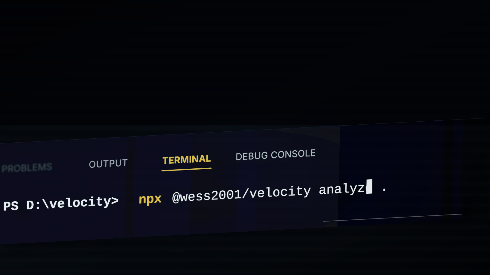

# Velocity

<p align="center">
  
</p>

**Find JavaScript performance risks, measure real Node.js runtime behavior, and stop regressions before they reach production.**

Velocity combines three workflows that normally require separate tools:

1. static diagnostics for JavaScript and TypeScript;
2. repeatable command benchmarks with saved baselines;
3. Node.js CPU, memory and event-loop profiling without application instrumentation.

It works with browser code, Node.js services, APIs, workers, scripts and libraries.

> Velocity is evidence-first: a static finding is described as a risk, while speedups are only reported after measurement.

## Install

Run directly with npm:

```bash
npx @wess2001/velocity analyze .
```

Or install it in a project:

```bash
npm install --save-dev @wess2001/velocity
```

Then use the local binary:

```bash
npx velocity analyze .
```

## Static performance diagnostics

```bash
velocity analyze .
```

Velocity currently detects:

- synchronous filesystem operations that block the Node.js event loop;
- synchronous child processes;
- independent async work that may be serialized inside loops;
- DOM lookups repeated inside loops;
- repeated collection traversals on potential hot paths;
- intervals that cannot be cleaned up;
- unusually large source files.

Reports include the project stack, exact source location, severity, explanation, remediation and a score suitable for automation.

```text
Velocity performance report
checkout-api · JavaScript · Fastify
78/100 · 42 files · 5,901 lines

src/catalog.js
  ✖ 18: readFileSync blocks the Node.js event loop.
    node/no-blocking-fs — Use the equivalent API from node:fs/promises and await it.
```

Use JSON when another tool needs the report:

```bash
velocity analyze . --json
```

### Reviewed suppressions

Suppress one reviewed case without disabling the rule globally:

```js
// velocity-ignore-next-line node/no-blocking-fs -- required during process exit
fs.writeFileSync(reportPath, report);
```

## Prevent regressions in CI

Create a baseline:

```bash
velocity analyze . --save .velocity/baseline.json
```

Compare a later version:

```bash
velocity compare .velocity/baseline.json . --max-score-drop 2
```

The command exits unsuccessfully when a new error appears or the permitted score drop is exceeded. Issue fingerprints do not include line numbers, so unrelated line movement is not treated as a regression.

For a simple quality gate without a baseline:

```bash
velocity check . --min-score 85
```

## Benchmark any command

```bash
velocity bench --runs 10 --warmup 2 -- npm run build
```

Velocity reports average, minimum, maximum, p50 and p95 wall-clock duration.

Save a benchmark and detect a regression later:

```bash
velocity bench --runs 10 --save .velocity/build.json -- npm run build
velocity bench --runs 10 --compare .velocity/build.json --max-regression 8 -- npm run build
```

The second command fails when average duration regresses by more than 8%.

## Profile a Node.js process

```bash
velocity profile -- node server.js
```

Without changing the target application, Velocity measures:

- user and system CPU time;
- current and peak RSS memory;
- heap and external memory;
- event-loop utilization;
- mean, p95, p99 and maximum event-loop delay;
- process duration and exit status.

Save the complete profile as JSON:

```bash
velocity profile --save .velocity/profile.json -- node worker.js
```

The profiler is designed for direct Node.js commands. Package-manager commands can create several Node.js processes, so profile the underlying entry point when you need process-level accuracy.

## Configuration

Create `velocity.config.json`:

```bash
velocity init
```

Example:

```json
{
  "minScore": 80,
  "maxFileSizeKb": 250,
  "failOn": "error",
  "rules": {
    "js/repeated-array-passes": "off",
    "async/no-await-in-loop": "error"
  },
  "ignore": ["node_modules", ".git", "dist", "coverage", ".next"]
}
```

Each rule can be turned off or assigned `info`, `warning` or `error` severity.

## Programmatic API

```js
import {
  analyzeProject,
  benchmark,
  compareBenchmarks,
  compareReports,
  profileNodeProcess
} from "@wess2001/velocity";

const report = await analyzeProject(".");
const timing = await benchmark("node", ["server.js"], { runs: 10 });
const profile = await profileNodeProcess("node", ["worker.js"], { stdio: "ignore" });
```

The package ships TypeScript declarations and has no third-party runtime dependencies.

## Commands

| Command | Purpose |
| --- | --- |
| `velocity analyze [path]` | Find likely performance risks |
| `velocity check [path]` | Enforce score and severity budgets |
| `velocity compare <baseline> [path]` | Detect new static-analysis regressions |
| `velocity bench -- <command>` | Measure repeatable wall-clock performance |
| `velocity profile -- <node-command>` | Inspect CPU, memory and event-loop behavior |
| `velocity init [path]` | Create a configuration file |

## Design principles

- **Measure before promising.** Static suggestions are not presented as proven speedups.
- **Safe by default.** Velocity never rewrites application code.
- **Explain every finding.** Every issue includes cause, location and remediation.
- **Low adoption cost.** The CLI has no third-party runtime dependencies.
- **Regression-oriented.** Baselines turn isolated measurements into enforceable budgets.

## Development

Requires Node.js 20 or newer.

```bash
npm install
npm run check
npm run demo
```

CI validates Node.js 20, 22 and 24.

## Roadmap

- parser-backed rules with more precise control-flow analysis;
- HTTP latency and throughput scenarios;
- profile and benchmark history reports;
- framework adapters for Express, Fastify, React and Next.js;
- plugin API for internal and community rules;
- safe codemods with patch previews and rollback.

## License

MIT © WessYu
